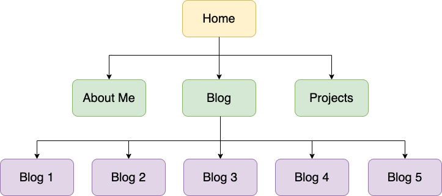
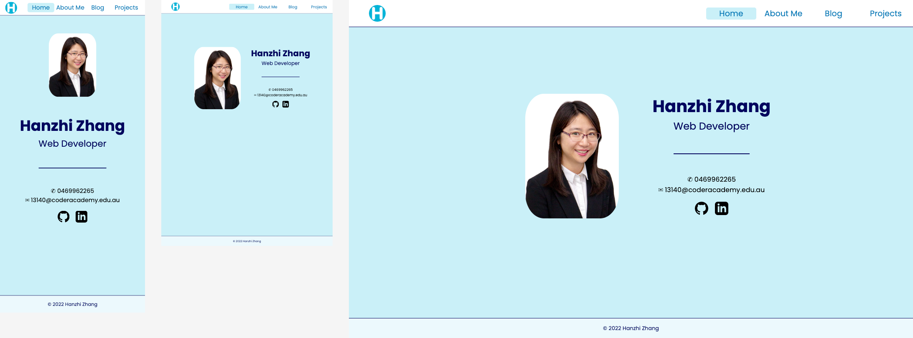
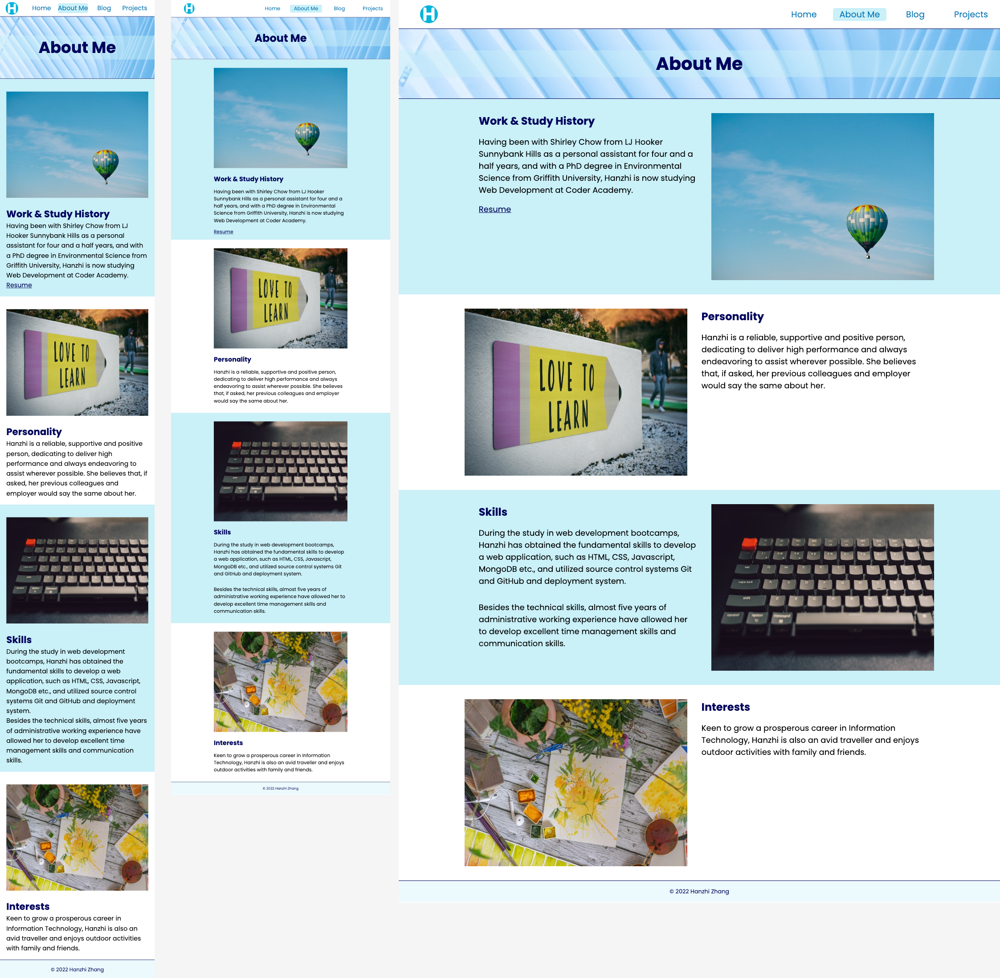
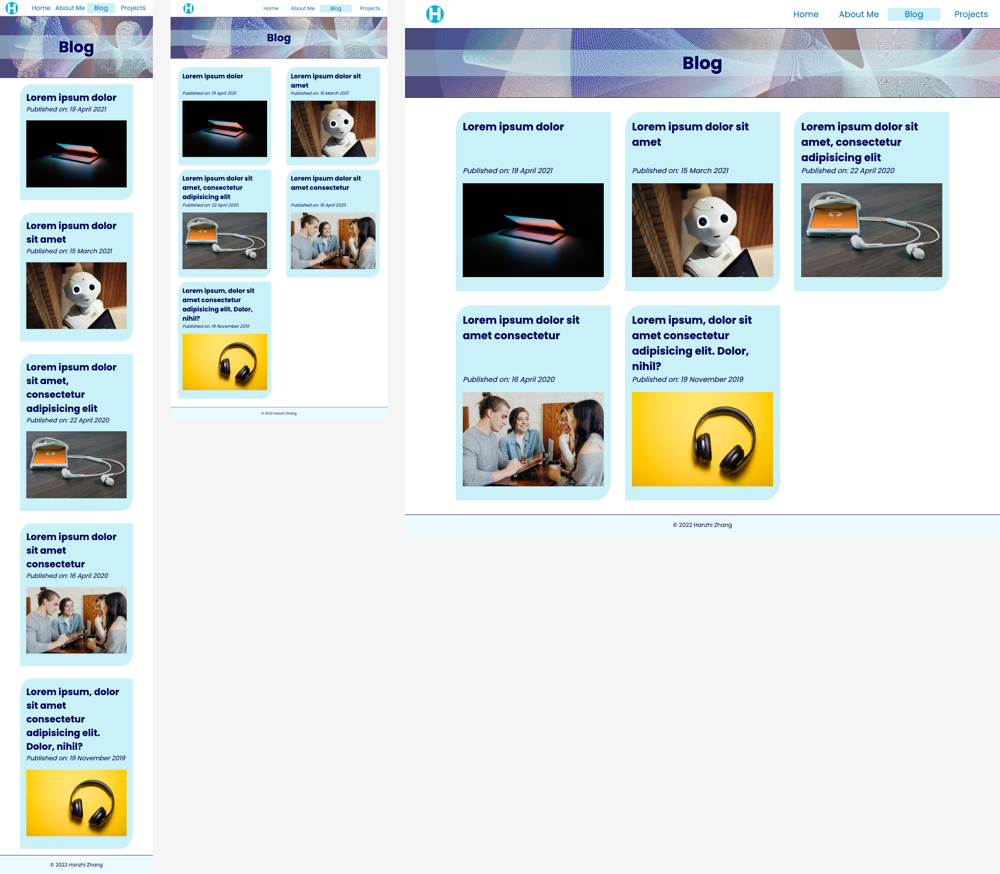
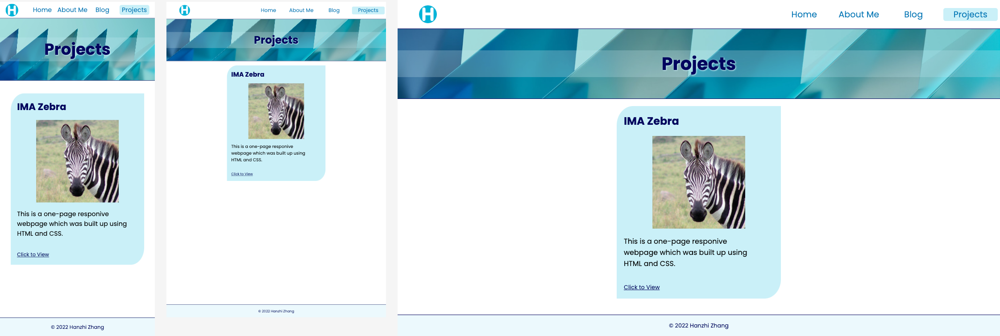

# Link (URL) to my portfolio website

https://hanzhi-zhang.netlify.app/

# Link (URL) to my presentation

https://youtu.be/ELef09McWlQ

# Link to my GitHub repo

https://github.com/Hanzhi11/Portfolio_HanzhiZhang_T1A2

# Description of my portfolio website:

## Purpose

In order to demonstrate my abilities to my potential employers, I would like to build up a professinal portfolio website to showcase my knowledge and skills in web development and IT areas as well as my coding experience.

## Functionality / features

This resposive and east-to-navigate website is equiped with four functions:

1. Home page is designed to display my name and contact details.
2. About Me page is for my previous work and study experience, personality, skills and interests.
3. Blog page provides the list of blog posts. The blog post card on the list displays post's title and publish date, and also provides users an access to the content of the post.
4. Projects page is a showcase of the projects that I have conducted.
## Sitemap

## Screenshots

## Target audience

The target audience of this portfolio website is my potential employers who are looking for a web developer.

## Tech stack (e.g. html, css, deployment platform, etc)

- Sitemap: app.diagrams.net
- Wireframe: Figma
- Portfolio website: HTML5 & CSS
- Website deployment platform: Netlify
- Version control: Git & Github
